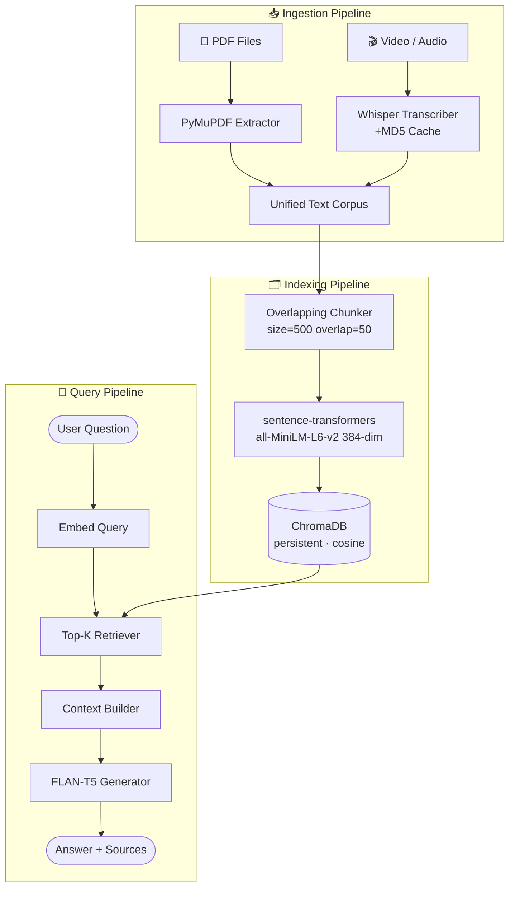

<div align="center">

```
██████╗  █████╗  ██████╗      ██████╗██╗  ██╗ █████╗ ████████╗██████╗  ██████╗ ████████╗
██╔══██╗██╔══██╗██╔════╝     ██╔════╝██║  ██║██╔══██╗╚══██╔══╝██╔══██╗██╔═══██╗╚══██╔══╝
██████╔╝███████║██║  ███╗    ██║     ███████║███████║   ██║   ██████╔╝██║   ██║   ██║
██╔══██╗██╔══██║██║   ██║    ██║     ██╔══██║██╔══██║   ██║   ██╔══██╗██║   ██║   ██║
██║  ██║██║  ██║╚██████╔╝    ╚██████╗██║  ██║██║  ██║   ██║   ██████╔╝╚██████╔╝   ██║
╚═╝  ╚═╝╚═╝  ╚═╝ ╚═════╝      ╚═════╝╚═╝  ╚═╝╚═╝  ╚═╝   ╚═╝   ╚═════╝  ╚═════╝    ╚═╝
```

### ⚡ Lecture-to-Chat Pipeline · 100% Local · No API Keys · CLI-First

<br/>

[](https://python.org)
[](https://langchain.com)
[](https://trychroma.com)
[](https://github.com/openai/whisper)
[](https://huggingface.co/google/flan-t5-base)
[](LICENSE)

<br/>

> *Drop in lecture PDFs and videos. Ask anything. Get grounded answers with sources.*
> *Everything runs on your machine — no cloud, no cost, no data leakage.*

</div>

<br/>

---

<div align="center">

## ✦ · · · · · · · · · · · · · · · · · · · · · · · · · · · · · · ✦

</div>

<br/>

## 🧠 &nbsp; What Is This?

A **complete Retrieval-Augmented Generation pipeline** that ingests lecture PDFs and video/audio recordings,
builds a persistent semantic knowledge base, and lets you chat with that content entirely offline via a clean terminal interface.

```
  PDFs  ──┐
           ├──► Chunk ──► Embed ──► ChromaDB ──► Retrieve ──► FLAN-T5 ──► Answer
  Video ──┘
  (Whisper)
```

<br/>

---

<br/>

## ✨ &nbsp; Highlights

<br/>

| | Feature | Detail |
|---|---|---|
| 🎯 | **Multi-modal ingestion** | PDFs + MP4/MP3/WAV/M4A/WEBM in one pass |
| 🔒 | **Fully local** | All models run on-device — zero API keys |
| 💾 | **Persistent vector store** | ChromaDB survives restarts; no re-embedding needed |
| ⚡ | **Transcript caching** | MD5-hash cache prevents re-transcribing same files |
| 🔍 | **Cosine retrieval** | Top-K semantic search with per-chunk relevance scores |
| 🗣️ | **Interactive CLI loop** | Clean chat session with source attribution per reply |
| 🛠️ | **Configurable quality** | Swap Whisper model size and LLM tier per run |

<br/>

---

<br/>

## 🖥️ &nbsp; Terminal Preview

<br/>

```text
╔══════════════════════════════════════════════════════════════════════╗
║          RAG Chatbot — GenAI Lecture Knowledge Base                 ║
╚══════════════════════════════════════════════════════════════════════╝

  [1/4] Loading embedding model .............. ✓  all-MiniLM-L6-v2 (384-dim)
  [2/4] Initializing vector store ............ ✓  genai_lectures · 847 chunks
  [3/4] Setting up retriever ................. ✓  cosine similarity
  [4/4] Loading LLM .......................... ✓  flan-t5-base (device: cpu)

╔══════════════════════════════════════════════════════════════════════╗
║                    Interactive Mode — RAG Chat                      ║
║            Type  'quit'  or  'exit'  to end the session             ║
╚══════════════════════════════════════════════════════════════════════╝

  You › Why is hybrid search better than vector-only search?

  Retrieved 5 relevant chunks:
    - RAG-intro.pdf        score=0.873
    - GenAI.pdf            score=0.841
    - RAG-intro.pdf        score=0.809

  Bot › Hybrid search combines vector similarity with keyword (BM25)
        matching, ensuring both semantic and exact-term relevance is
        captured. Vector-only search can miss precise terminology...

  [Sources: RAG-intro.pdf, GenAI.pdf]

  You › quit
  Goodbye! ✓
```

<br/>

---

<br/>

## 🏗️ &nbsp; Architecture

<br/>



<br/>

---

<br/>

## 🔧 &nbsp; Tech Stack

<br/>

<div align="center">

| Layer | Tool | Role |
|---|---|---|
| 📄 **PDF Extraction** | `PyMuPDF (fitz)` | Per-page text extraction |
| 🎙️ **Transcription** | `OpenAI Whisper` (local) | Speech-to-text with hash cache |
| ✂️ **Chunking** | Custom `TextChunker` | Overlapping semantic splits |
| 🔢 **Embeddings** | `sentence-transformers` | 384-dim dense vectors |
| 🗄️ **Vector Store** | `ChromaDB` | Cosine-similarity persistent DB |
| 🔍 **Retrieval** | `Retriever` module | Top-K with relevance scoring |
| 🤖 **Generation** | `FLAN-T5-base / large` | Local seq2seq LLM |
| 💻 **Interface** | Python CLI | Interactive + test modes |

</div>

<br/>

---

<br/>

## 📁 &nbsp; Project Layout

<br/>

```text
rag-chatbot-genai/
│
├── 📂 Data/
│   ├── GenAI.pdf                  ← included
│   └── RAG-intro.pdf              ← included
│
├── 📦 rag_chatbot/
│   ├── chatbot.py                 ← orchestration & pipeline entry
│   ├── pdf_loader.py              ← PyMuPDF extraction
│   ├── audio_transcriber.py       ← Whisper + MD5 caching
│   ├── chunker.py                 ← overlapping text splitter
│   ├── embedder.py                ← sentence-transformer wrapper
│   ├── vector_store.py            ← ChromaDB client
│   ├── retriever.py               ← cosine top-K search
│   ├── generator.py               ← FLAN-T5 response generation
│   └── __init__.py
│
├── 🚀 main.py                     ← CLI entry point + argparse
├── 🧪 test_chatbot.py             ← batch test runner
├── 📋 requirements.txt
└── 📝 answer_log.txt              ← test run output
```

<br/>

---

<br/>

## 🚀 &nbsp; Quick Start

<br/>

### &nbsp; Step 1 &nbsp;—&nbsp; Clone

```bash
git clone https://github.com/Misrilal-Sah/rag-chatbot-genai.git
cd rag-chatbot-genai
```

<br/>

### &nbsp; Step 2 &nbsp;—&nbsp; Virtual Environment

```bash
# Windows
python -m venv venv
venv\Scripts\activate

# Linux / macOS
python -m venv venv
source venv/bin/activate
```

<br/>

### &nbsp; Step 3 &nbsp;—&nbsp; Install Dependencies

```bash
pip install -r requirements.txt
```

<br/>

### &nbsp; Step 4 &nbsp;—&nbsp; Install FFmpeg  *(audio/video only)*

```bash
# Windows (winget)
winget install FFmpeg

# macOS
brew install ffmpeg

# Ubuntu / Debian
sudo apt install ffmpeg
```

<br/>

### &nbsp; Step 5 &nbsp;—&nbsp; Add Your Media

```text
Data/
 ├── YourLecture.pdf          ← any number of PDFs
 ├── lecture_part1.mp4        ← optional video files
 └── lecture_audio.mp3        ← optional audio files
```

> Two PDFs (`GenAI.pdf`, `RAG-intro.pdf`) are already included and ready to chat with.

<br/>

---

<br/>

## ⚙️ &nbsp; Run Modes

<br/>

```bash
# ── Start interactive chat (index on first run)
python main.py

# ── Force rebuild of the entire vector index
python main.py --reindex

# ── Run the 3 standard test questions  →  saves answer_log.txt
python main.py --test

# ── Use a better (slower) Whisper model for transcription
python main.py --whisper-model small    # tiny | base | small | medium | large

# ── Run test script directly
python test_chatbot.py
```

<br/>

> **Whisper model trade-off**
>
> | Model | Speed | Accuracy |
> |---|---|---|
> | `tiny` | ⚡ fastest | ★★☆☆☆ |
> | `base` | ⚡ fast *(default)* | ★★★☆☆ |
> | `small` | 🔄 moderate | ★★★★☆ |
> | `medium` | 🐢 slow | ★★★★★ |
> | `large` | 🐢🐢 slowest | ★★★★★ |

<br/>

---

<br/>

## 🧪 &nbsp; Built-In Test Questions

<br/>

The following prompts are validated against the ingested lecture content:

<br/>

> **Q1** — *"What are the production Do's for RAG?"*
>
> **Q2** — *"What is the difference between standard retrieval and the ColPali approach?"*
>
> **Q3** — *"Why is hybrid search better than vector-only search?"*

<br/>

Results and source citations are written to `answer_log.txt` on completion.

<br/>

---

<br/>

## 📌 &nbsp; Performance Notes

<br/>

- **First transcription** of video files takes 10–20 min; result is cached and reused instantly on subsequent runs
- **ChromaDB** persists in `chroma_db/` — zero re-embedding cost after the first index build
- **FLAN-T5-base** is the default for speed; set `use_light_llm=False` in `chatbot.py` for FLAN-T5-large quality
- GPU is auto-detected — `cuda` if available, otherwise `cpu`

<br/>

---

<br/>

<div align="center">

## ✦ · · · · · · · · · · · · · · · · · · · · · · · · · · · · · · ✦

<br/>

**Built for the AI Academy GenAI course — local-first, offline-capable, production-aware.**

*If this project helped you, consider ⭐ starring the repo*
*and exploring extensions like hybrid BM25 search, reranking, or streaming output.*

<br/>


<br/>

</div>
